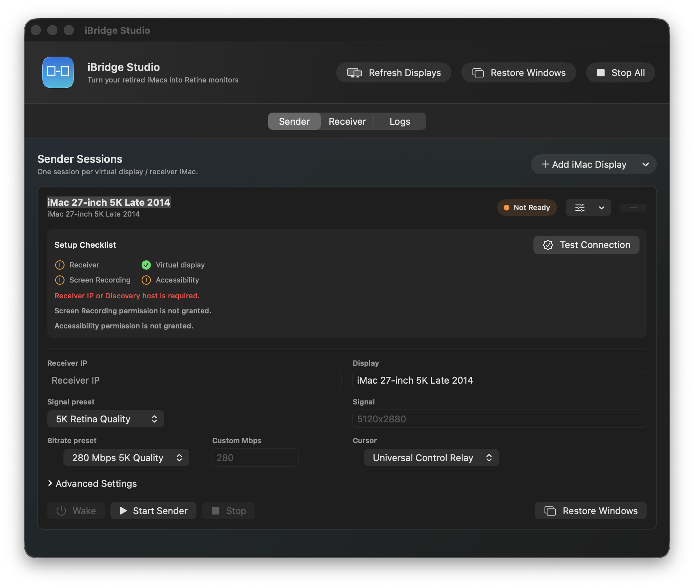
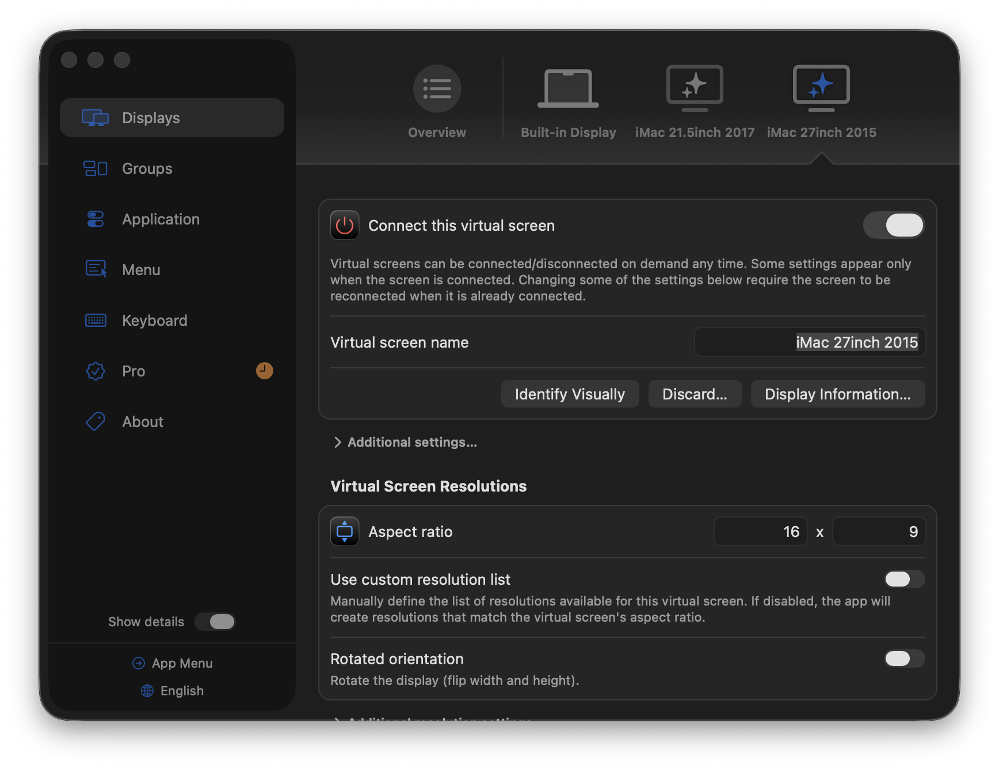

# iBridge Studio

iBridge Studio는 Target Display Mode가 지원되지 않는 iMac을 MacBook의 소프트웨어 Retina display처럼 다시 쓰기 위한 macOS alpha 앱입니다.

## Why I Built It / 만든 이유

Developing on a MacBook created a clear need for an external display that matched its sharp 5K Retina resolution. Rather than simply purchasing an expensive Apple 5K display, I realized I could repurpose the 5K iMac I already owned — and built a software solution to bypass the discontinued Target Display Mode on older iMacs.

MacBook 환경에서 개발하면서 내장 화면만큼 선명한 5K 고화질 외장 모니터에 대한 니즈가 있었습니다. 고가의 Apple 5K 디스플레이를 구매하기보다, 집에 이미 가지고 있던 5K iMac 패널을 직접 활용할 수 있겠다는 생각이 들었습니다. 공식 지원이 끊긴 구형 iMac의 Target Display Mode 문제를 소프트웨어 방식으로 직접 해결해 외장 모니터로 재탄생시켰습니다.

### How It Works / 작동 방식

한 앱인 `iBridge Studio.app`를 MacBook과 iMac에 모두 설치합니다. MacBook에서는 Sender가 BetterDisplay virtual display를 캡처하고, iMac에서는 Receiver가 전체 화면으로 수신 영상을 표시합니다.



```text
MacBook Pro / MacBook Air
  BetterDisplay virtual display
  iBridge Studio Sender: ScreenCaptureKit -> VideoToolbox HEVC -> TCP

Ethernet / Thunderbolt Bridge / LAN

iMac
  iBridge Studio Receiver: TCP -> VideoToolbox decode -> fullscreen display
```

## v0.1.1-alpha 상태

이번 alpha는 내부 테스트용이지만, 이전 버전보다 제품형 흐름에 가까워졌습니다.

- 개인 IP, SSH user, Wake MAC이 제품 preset에서 제거되었습니다.
- Sender card가 기본 설정과 Advanced Settings로 나뉘었습니다.
- Receiver tab에서 This Mac receiver를 Start/Stop할 수 있고, 현재 listening port와 이 Mac의 IP 후보를 볼 수 있습니다.
- Menu bar에서 session별 Start/Stop, Receiver Start/Stop, Open Logs, Restore Windows를 실행할 수 있습니다.
- Logs는 2,000줄 ring buffer, level/session filter, copy, diagnostics export를 지원합니다.
- Wake-on-LAN은 magic packet을 3회 보내고, 설정된 receiver port가 열릴 때까지 polling할 수 있습니다.
- 패키지는 `.zip`, `.dmg`, `.pkg` 산출물을 만들 수 있습니다. Developer ID 인증서가 있으면 notarization 경로도 준비되어 있습니다.

## 테스트한 환경

현재 실사용 기준은 다음 조합입니다.

- Sender: MacBook Pro
- Virtual display app: BetterDisplay 4.2.3
- Receiver 1: 2015 27-inch 5K iMac
- Receiver 2: 2017 21.5-inch 4K iMac
- iMac OS strategy: OpenCore Legacy Patcher(OCLP)로 macOS Sequoia까지 올린 환경
- 권장 receiver OS: macOS 13 Ventura 이상, 현재 alpha 실사용 권장선은 OCLP Sequoia

Tahoe는 이 alpha에서 권장하지 않습니다. Tahoe 계열은 Apple Intelligence, Siri, system services, graphics/input permission surface가 더 많이 바뀌어 OCLP 기반 Intel iMac에서 변수가 늘어납니다. iBridge Studio는 낮은 지연, fullscreen receiver, input relay, Screen Recording/Accessibility 권한 안정성이 중요하므로, 현재는 Sequoia를 안정 기준으로 둡니다.

## BetterDisplay 설정

MacBook 쪽에서는 BetterDisplay virtual screen을 “확장 디스플레이”로 만들어야 합니다. Mirroring이나 AirPlay처럼 동작하면 iBridge Sender가 원하는 화면을 안정적으로 캡처하지 못합니다.



권장 흐름:

1. BetterDisplay를 설치하고 실행합니다.
2. Virtual Screen을 추가합니다.
3. macOS Displays에서 virtual screen을 MacBook 내장 화면 옆에 배치합니다.
4. iBridge Studio의 Sender card에서 `Display` 이름을 BetterDisplay virtual screen 이름과 맞춥니다.
5. iMac 모델에 맞는 signal preset을 고릅니다.

권장 이름:

- 2015 27-inch 5K iMac: `iMac 27-inch 5K Late 2015`
- 2017 21.5-inch 4K iMac: `iMac 21.5-inch 4K 2017`

권장 품질 시작점:

| Receiver | BetterDisplay 목적 | iBridge signal | Bitrate | Profile |
| --- | --- | --- | --- | --- |
| 2015 27-inch 5K iMac | 5K Retina canvas | `5120x2880` | `280 Mbps` | `lan-60hz` |
| 2017 21.5-inch 4K iMac | 4K Retina canvas | `4096x2304` | `220 Mbps` | `imac4k-quality` |
| unstable LAN fallback | smooth test | `2560x1440` | `80 Mbps` | `lan-60hz` |

처음 연결할 때는 1440p 또는 4K로 먼저 확인한 뒤 5K/고 bitrate로 올리는 편이 좋습니다.

## 설치

GitHub Release 또는 `dist/` 산출물에서 다음 중 하나를 사용합니다.

- `iBridge-Studio-0.1.1-alpha.dmg`: 일반 테스트에 권장
- `iBridge-Studio-0.1.1-alpha.pkg`: `/Applications` 설치 테스트용
- `iBridge-Studio-0.1.1-alpha.zip`: 수동 전송용

iMac 두 대 모두 같은 앱을 설치합니다. iMac에서는 Receiver tab을 열고 `Start Receiver on This Mac`을 누릅니다. MacBook에서는 Sender tab에서 iMac display session을 추가하고 receiver address를 입력합니다.

Gatekeeper 경고가 뜨면 아직 Developer ID notarization이 적용되지 않은 내부 alpha이기 때문입니다. Developer ID signing/notarization은 배포 인증서가 있는 머신에서 `CODE_SIGN_IDENTITY`와 `NOTARY_PROFILE`을 지정해 처리합니다. 자세한 내용은 [Developer Guide](docs/DEVELOPER.md)를 보세요.

## 권한

MacBook Sender:

- Screen Recording: BetterDisplay virtual screen 캡처에 필요합니다.
- Accessibility: Restore Windows와 input relay 안정화에 필요합니다.
- Local Network: receiver Mac과 TCP 연결할 때 필요할 수 있습니다.

iMac Receiver:

- Accessibility: receiver fullscreen surface와 input relay 안정화에 필요할 수 있습니다.
- Local Network: MacBook Sender의 TCP 연결을 받기 위해 필요합니다.

iBridge Studio의 Sender checklist에서 Screen Recording / Accessibility 상태를 볼 수 있습니다. 권한을 바꾼 뒤에는 앱과 sender/receiver process를 다시 시작하는 것이 안전합니다.

## 기본 사용 흐름

### iMac에서 Receiver 준비

1. `iBridge Studio.app` 실행
2. `Receiver` tab 선택
3. Port가 `48320`인지 확인
4. `Start Receiver on This Mac`
5. `Listening on :48320` 상태 확인
6. `This Mac addresses`에서 Ethernet, Thunderbolt Bridge, Wi-Fi 중 Sender가 접근할 주소를 복사

### MacBook에서 Sender 시작

1. BetterDisplay virtual screen이 켜져 있고 extended display인지 확인
2. `iBridge Studio.app` 실행
3. `Sender` tab 선택
4. `Add iMac Display`에서 iMac 모델 선택
5. Receiver IP 입력
6. `Refresh Displays` 또는 `Test Connection`으로 checklist 확인
7. Signal / Bitrate / Cursor 확인
8. `Start Sender`

Start Sender는 Wake 설정이 있으면 Wake packet을 보내고, receiver address를 확인한 뒤, virtual display capture sender를 실행합니다. 실패 원인은 Logs뿐 아니라 sender card checklist에서도 바로 확인할 수 있게 만들고 있습니다.

## 두 iMac 동시 연결 권장 구성

가장 안정적인 구성은 각 iMac에 별도 물리 경로를 주는 것입니다.

```text
MacBook Pro Ethernet -> 2015 27-inch iMac Ethernet
MacBook Pro Thunderbolt / USB-C -> 2017 21.5-inch iMac Thunderbolt Bridge
```

권장 수동 IP 예시는 [Network Setup](docs/NETWORK_SETUP.md)에 정리되어 있습니다. 실제 IP는 각 환경에서 직접 정하고, README나 소스에 개인 IP를 커밋하지 않습니다.

## 입력 릴레이와 Cursor

iBridge Studio의 cursor mode는 세 가지입니다.

- iBridge Cursor Overlay: 캡처 영상에서는 MacBook cursor를 숨기고, MacBook cursor 위치를 별도 low-latency overlay packet으로 receiver 위에 그립니다.
- Show Captured Cursor: Universal Control을 쓰지 않을 때 MacBook virtual display의 cursor를 영상에 표시합니다.
- Hide Captured Cursor: 영상만 보여주거나 cursor 중복이 생길 때 사용합니다.

iBridge Cursor Overlay 모드는 mouse cursor를 영상 frame에 굽지 않습니다. MacBook sender가 virtual display 위 cursor 위치를 별도 packet으로 보내고, iMac receiver가 video layer 위에 cursor를 즉시 그립니다. iMac receiver 위에서 발생한 click, drag, scroll, keyboard event는 같은 TCP stream의 역방향 input line으로 MacBook sender에 돌아가고, MacBook에서 해당 좌표를 BetterDisplay virtual display 좌표로 변환해 주입합니다. 따라서 이 모드는 MacBook iBridge Studio와 iMac iBridge Studio 양쪽 모두 Accessibility 권한이 필요합니다.

최상의 입력 경험은 Universal Control, iBridge input relay, macOS 입력 소스 설정의 영향을 받습니다. Caps Lock 한영 전환은 MacBook 쪽 Keyboard 입력 소스 설정이 맞아야 합니다.

## 문제 해결

대표적인 실패 지점:

- Receiver offline: iMac receiver가 실행 중인지, 같은 네트워크인지 확인합니다.
- Virtual display not found: BetterDisplay virtual screen 이름과 Sender card의 Display 이름이 같은지 확인합니다.
- Black screen: receiver fullscreen은 떠 있지만 sender capture/display selection이 다른 화면을 잡았을 수 있습니다.
- Permission missing: Screen Recording / Accessibility 권한을 허용하고 앱을 재시작합니다.
- Wake failed: Wake MAC, broadcast target, iMac 전원/네트워크 adapter의 Wake 설정을 확인합니다.

자세한 항목은 [Troubleshooting](docs/TROUBLESHOOTING.md)을 보세요.

## 개발 문서

- [Developer Guide](docs/DEVELOPER.md)
- [Network Setup](docs/NETWORK_SETUP.md)
- [Troubleshooting](docs/TROUBLESHOOTING.md)

## 현재 한계

- v0.1.1-alpha는 아직 내부 alpha입니다.
- Developer ID signing과 notarization은 인증서가 있는 머신에서만 완료됩니다.
- 5K60 완전 네이티브 품질은 네트워크, encoder, receiver decode 상태에 따라 달라집니다.
- Bonjour/mDNS discovery, adaptive bitrate, polished onboarding, auto update는 다음 단계입니다.

## Topics

[`external-display`](https://github.com/topics/external-display) · [`hevc`](https://github.com/topics/hevc) · [`macos`](https://github.com/topics/macos) · [`screen-streaming`](https://github.com/topics/screen-streaming) · [`screencapturekit`](https://github.com/topics/screencapturekit) · [`swift`](https://github.com/topics/swift) · [`tcp`](https://github.com/topics/tcp) · [`videotoolbox`](https://github.com/topics/videotoolbox)
